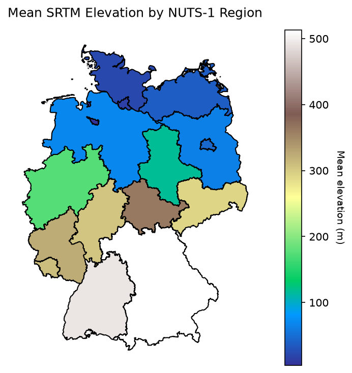
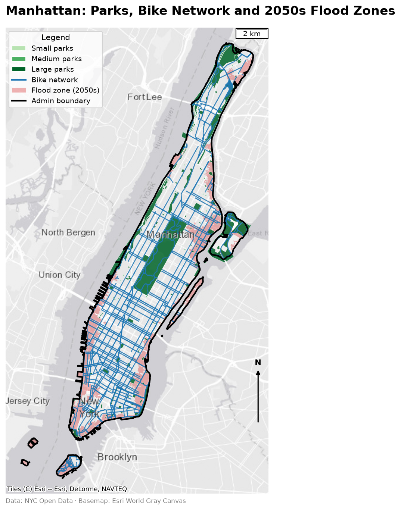
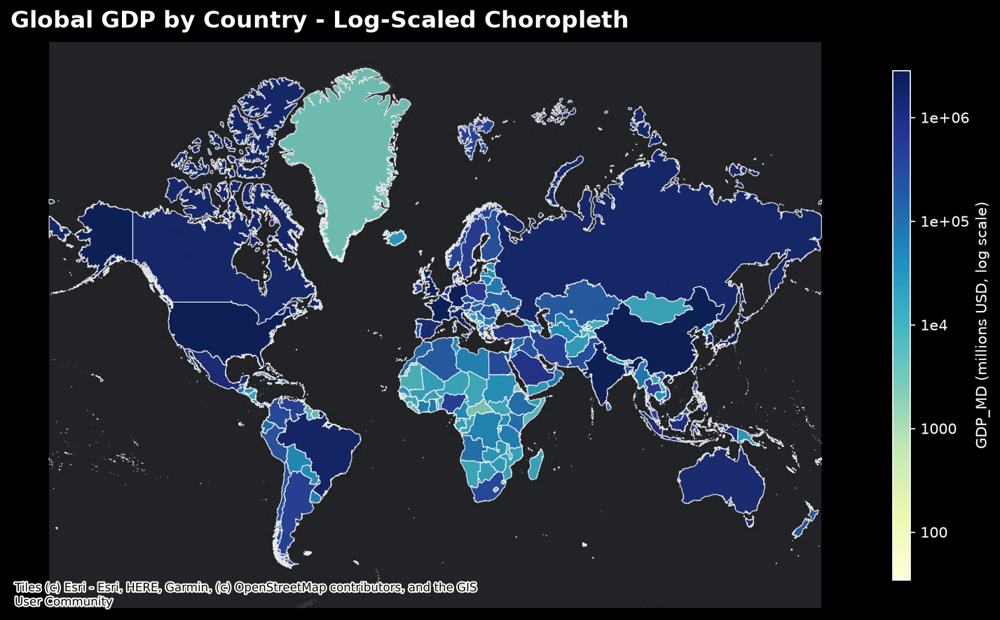
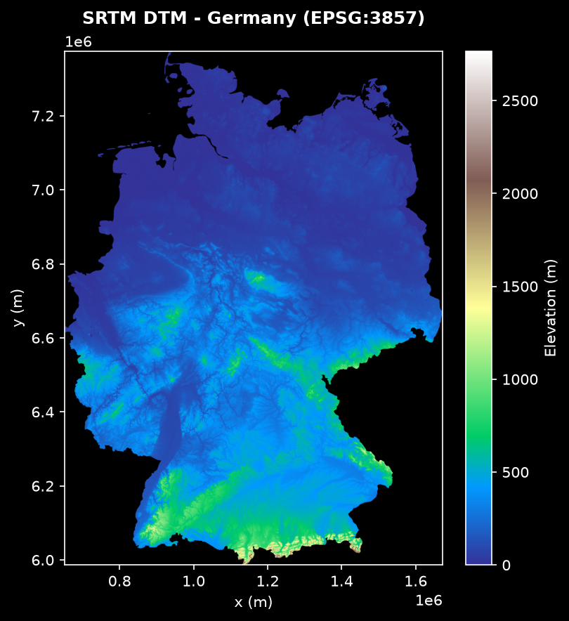

# Advanced Geospatial Analysis

Hands-on notebooks covering raster and vector processing, zonal statistics, and map design in
Python, built while working through two LinkedIn Learning courses by **Milan Janosov, Ph.D.**:
*Advanced Geospatial Data Analytics in Python* and *Advanced Spatial Data Visualization in Python*.
Every notebook downloads
its own data from public sources, so each one runs top to bottom in Google Colab or a local
environment with nothing to upload. The notebooks are also written to stay within a few hundred MB
of RAM, so they run on small Colab and Codespaces machines.

## Notebooks

| # | Notebook | What it does | Data |
|---|---|---|---|
| 01 | [`01_raster_vector_zonal_stats.ipynb`](01_raster_vector_zonal_stats.ipynb) [](https://colab.research.google.com/github/saverin0/Advanced_Geospatial_Analysis/blob/main/01_raster_vector_zonal_stats.ipynb) | Inspect and plot an SRTM DSM, load NUTS-1 regions, compute mean elevation per region, stride-based down-sampling | OpenDEM SRTM, Eurostat GISCO |
| 02 | [`02_raster_to_vector_grid.ipynb`](02_raster_to_vector_grid.ipynb) [](https://colab.research.google.com/github/saverin0/Advanced_Geospatial_Analysis/blob/main/02_raster_to_vector_grid.ipynb) | Thin a raster with a stride and convert pixel centres into a point `GeoDataFrame`, export as GeoPackage | OpenDEM SRTM, Eurostat GISCO |
| 03 | [`03_geoviz_foundational_tech.ipynb`](03_geoviz_foundational_tech.ipynb) [](https://colab.research.google.com/github/saverin0/Advanced_Geospatial_Analysis/blob/main/03_geoviz_foundational_tech.ipynb) | Log-scaled world GDP choropleth on a dark basemap, then clip and reproject a DTM to Web Mercator | Natural Earth, OpenDEM SRTM |
| 04 | [`04_geoviz_urban_data_nyc.ipynb`](04_geoviz_urban_data_nyc.ipynb) [](https://colab.research.google.com/github/saverin0/Advanced_Geospatial_Analysis/blob/main/04_geoviz_urban_data_nyc.ipynb) | Pull parks, bike routes and 2050s flood zones from the Socrata API, clip to Manhattan, build a finished map with legend, scale bar and north arrow | NYC Open Data |

## Sample output

| Mean elevation by NUTS-1 region | Manhattan parks, bike network and flood zones |
|---|---|
|  |  |

| World GDP, log-scaled | SRTM DTM of Germany in EPSG:3857 |
|---|---|
|  |  |

## Running

**Colab.** Click a badge above. Each notebook installs the one or two packages Colab lacks
(`rasterstats`, `contextily`, `mapclassify`) in its first cell.

**Locally.**

```bash
pip install -r requirements.txt
jupyter lab
```

Data is downloaded into `data/` on first run and reused afterwards. The two SRTM archives are
about 90 MB each. Figures are written to `figures/`. Both folders are git-ignored except for the
committed sample figures.

The Colab badges point at `saverin0/Advanced_Geospatial_Analysis`. If the repository is renamed,
search and replace that string in the notebooks and this README.

## Data sources and licences

| Source | Used for | Licence |
|---|---|---|
| [OpenDEM](https://www.opendem.info/download_srtm.html) SRTM Germany DSM and DTM | Notebooks 01, 02, 03 | Derived from NASA SRTM, public domain |
| [Eurostat GISCO](https://ec.europa.eu/eurostat/web/gisco/geodata/statistical-units/territorial-units-statistics) NUTS 2016 | Notebooks 01, 02 | Free for non-commercial use with attribution, see GISCO terms |
| [Natural Earth](https://www.naturalearthdata.com/) Admin 0 countries, 1:10m | Notebook 03 | Public domain |
| [NYC Open Data](https://opendata.cityofnewyork.us/) DSNY Zones `ak2e-nbe8`, Parks Properties `enfh-gkve`, Bike Routes `mzxg-pwib`, Future Floodplain 2050s `27ya-gqtm` | Notebook 04 | NYC Open Data terms of use |
| [Esri Canvas basemaps](https://www.arcgis.com/home/item.html?id=8b3d38c0819547faa83f7b7aca80bd76) (World Gray Canvas, Dark Gray) via `contextily` | Notebooks 03, 04 | Free tile access with Esri attribution, no API key needed |

## Acknowledgements

These notebooks were written while following two LinkedIn Learning courses by
[Milan Janosov, Ph.D.](https://www.janosov.com/) The structure and the analytical steps follow his
exercises, and credit for the teaching material belongs to him.

| Notebooks | Course |
|---|---|
| 01, 02 | [Advanced Geospatial Data Analytics in Python](https://www.linkedin.com/learning/advanced-geospatial-data-analytics-in-python) · [official repo](https://github.com/LinkedInLearning/advanced-geospatial-data-analytics-in-python-3981645) |
| 03, 04 | [Advanced Spatial Data Visualization in Python](https://www.linkedin.com/learning/advanced-spatial-data-visualization-in-python) |

The course exercise files are LinkedIn's licensed materials and are not redistributed here. All
inputs were replaced with the equivalent openly published datasets listed above, and the code was
adapted to use them. This repository is a personal learning record, not a substitute for the courses.

## Licence

Code in this repository is released under the [MIT License](LICENSE). Data remains under the
licence of its respective publisher.
